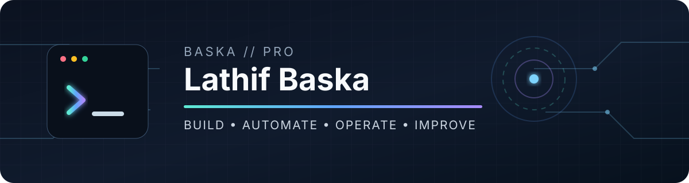

<p align="center">
  
</p>

<p align="center">
  <strong>IT • Automation • Systems • Open Source</strong>
</p>

<p align="center">
  I build practical software, Windows utilities, web applications, automation, bots, and server tools<br>
  with a focus on usability, maintainability, and real-world workflows.
</p>

<p align="center">
  <a href="https://github.com/baska-pro">
    
  </a>
  
  
</p>

---

## `> whoami`

```console
$ identity
Lathif Baska / baska-pro

$ based_in
Indonesia

$ focus
Windows tools • automation • web apps • bots • server management • self-hosted systems

$ approach
Useful > flashy
Simple > fragile
Automate what repeats
Understand what you operate
```

I enjoy turning repetitive or complicated workflows into practical tools that are easier to use, easier to maintain, and useful beyond a single experiment.

---

## What I Work With

<table>
<tr>
<td width="50%" valign="top">

### Application Development

- Python applications
- Flask web applications
- FastAPI backends
- Google Apps Script
- JavaScript / HTML / CSS
- PowerShell utilities
- Windows desktop tools
- REST API integrations

</td>
<td width="50%" valign="top">

### Automation & Bots

- Telegram bots
- WhatsApp bots & integrations
- Scheduled automation
- Background services
- Workflow automation
- Notification systems
- API-based integrations

</td>
</tr>

<tr>
<td width="50%" valign="top">

### Data & Storage

- SQLite
- PostgreSQL
- Google Sheets
- Spreadsheet-based databases
- JSON storage
- File-based data systems
- Data synchronization

</td>
<td width="50%" valign="top">

### Systems & Infrastructure

- Windows
- Linux
- Termux / Android
- Docker
- Cloud servers
- Self-hosted services
- Cloudflare
- Process monitoring
- Remote administration

</td>
</tr>
</table>

---

## Technology Ecosystem

### Languages & Scripting

<p>
  
  
  
  
  
  
  
</p>

### Backend & Web

<p>
  
  
  
</p>

### Data

<p>
  
  
  
  
</p>

### Platforms & Infrastructure

<p>
  
  
  
  
  
  
  
</p>

### Bots & Integrations

<p>
  
  
  
</p>

---

## AI-Assisted Development

I use AI as part of my development workflow for prototyping, debugging, architecture exploration, code generation, refactoring, and iterative improvement.

<p>
  
  
</p>

```text
Idea / Problem
      ↓
Architecture & Prototype
      ↓
AI-assisted Development
      ↓
Manual Review & Testing
      ↓
Integration
      ↓
Real-world Usage
      ↓
Iterate & Improve
```

---

## What I Build

```text
Desktop & Windows Tools
├── PowerShell GUI applications
├── Windows utilities
├── System management tools
└── Workflow helpers

Web Applications
├── Flask / Python web apps
├── Google Apps Script web apps
├── Dashboards
├── Management systems
└── Responsive browser tools

Automation
├── Telegram bots
├── WhatsApp integrations
├── Scheduled jobs
├── Notifications
└── Workflow automation

Data Systems
├── Google Sheets
├── SQLite
├── PostgreSQL
├── JSON / file storage
└── Data synchronization

Server & Infrastructure
├── Linux
├── Docker
├── Cloud servers
├── Self-hosted services
├── Monitoring
└── Remote administration

Mobile / Portable Environment
└── Termux & Android-based tooling
```

---

## Build Philosophy

```text
01. Solve a real problem first.
02. Keep the interface understandable.
03. Automate repetitive work.
04. Prefer maintainable solutions over unnecessary complexity.
05. Treat security, backups, and failure handling as features.
06. Improve continuously after real-world use.
```

---

## Featured Projects

> Public projects will be added here as they are released.

<!--
Example:

### Windows Shortcut Control
A PowerShell-based GUI utility for managing Windows shortcuts and common system tools.

[Repository](https://github.com/baska-pro/windows-shortcut-control)

### Windows App Locker
A Windows utility for controlling access to selected applications and web resources.

[Repository](https://github.com/baska-pro/windows-app-locker)

### Server Control
A server administration and monitoring toolkit with automation and remote-control features.

[Repository](https://github.com/baska-pro/server-control)
-->

---

## Development Activity

<p align="center">
  
</p>

<p align="center">
  
  
</p>

> GitHub activity represents only my public repositories. Many of my projects are developed locally, on servers, Google Apps Script, AI-assisted environments, and private infrastructure.

---

## Current Direction

- Publishing practical open-source tools
- Improving Windows and PowerShell utilities
- Building web-based management applications
- Developing Telegram and WhatsApp automation
- Building Google Apps Script and spreadsheet-backed systems
- Developing Python, Flask, SQLite, and server-side tools
- Exploring cloud, self-hosted services, and AI-assisted development
- Converting personal and internal tools into reusable public projects

---

## Project Communication

For bugs, feature requests, and technical discussions, use the **Issues** section of the relevant repository.

This keeps project history searchable and useful for other users.

---

<p align="center">
  <code>BUILD // AUTOMATE // OPERATE // IMPROVE</code>
</p>

<p align="center">
  <sub>Practical software for real workflows.</sub>
</p>
